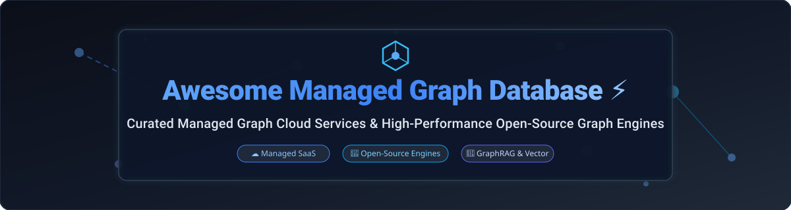

<p align="center">
  
</p>

# Awesome Managed Graph Database ⚡ 

<a href="https://github.com/ishandutta2007/Awesome-Awesome-Awesome"></a><a href="https://discord.gg/jc4xtF58Ve"></a>
[](https://github.com/ishandutta2007/Awesome-Managed-Graph-Database)
[](https://opensource.org/licenses/MIT)
[](#)
<a href="https://github.com/ishandutta2007"></a>

> **Curated List of SaaS Products, Cloud Services & Open-Source GitHub Projects**  
> *Focused on Managed Graph Databases, Self-Hosted Property Graphs, RDF Triple Stores, Distributed Graph Engines, and GraphRAG / Knowledge Graph Infrastructure.*

---

## 💡 Overview & Ecosystem Insights

This repository tracks notable **commercial managed graph databases (SaaS)** and high-performance **open-source graph database projects** that store, index, and query highly connected data — spanning fully managed cloud graph services, self-hosted property graphs, RDF triple stores, and distributed graph engines.

### 📊 Market Size & Industry Dynamics

- **Estimated Market Size**: The global graph database market was valued at **~$2.9 Billion in 2024** and is projected to reach **~$11.8 Billion by 2030** (CAGR of ~26.2%), accelerated by enterprise GraphRAG (Retrieval-Augmented Generation), knowledge graph adoption, vector-graph hybrid search, and real-time fraud detection.
- **Market Structure**: The sector is **moderately fragmented**. Big-tech cloud providers (**AWS Neptune**, **Azure Cosmos DB**) dominate cloud infrastructure integration, while specialized pure-play leaders (**Neo4j**) hold significant market share in property graph developer adoption. Meanwhile, fast-growing open-source distributed engines (**NebulaGraph**, **JanusGraph**) and niche AI-native graph stores (**FalkorDB**, **Kùzu**, **CozoDB**) capture high-growth specialized workloads.

---

## 📑 Table of Contents

- [☁️ SaaS / Hosted Cloud Platforms](#️-saas--hosted-cloud-platforms)
- [🚀 Open-Source GitHub Projects](#-open-source-github-projects)
  - [🏷️ Property Graph Databases](#️-property-graph-databases)
  - [🌐 RDF & Semantic Graph Databases](#-rdf--semantic-graph-databases)
  - [🐘 PostgreSQL Graph Extensions](#-postgresql-graph-extensions)
  - [⚙️ Additional Open-Source Options](#️-additional-open-source-options)
- [🤝 How to Contribute](#-how-to-contribute)
- [⚠️ Disclaimer](#️-disclaimer)

---

## ☁️ SaaS / Hosted Cloud Platforms

Below is a curated comparison of fully managed commercial graph databases and cloud services, sorted by **Company Scale (Revenue / Valuation)** descending.

| Platform 🌐 | Enterprise Key Highlights 🔑 | Starting Paid Tier Pricing 💳 | Free Tier / Trial Allowance 🎁 | Company Scale (Revenue / Valuation) 📈 |
| :--- | :--- | :--- | :--- | :--- |
| **[Azure Cosmos DB Gremlin API](https://azure.microsoft.com/en-us/products/cosmos-db/)** ⚡ | **Microsoft's globally distributed multi-model database** — Gremlin API for graph workloads. Turnkey global distribution with multi-region writes and SLAs. | **$0.008/100 RU/s per hour** (~$5.84/mo for 100 RU/s baseline + $0.25/GB storage) | **Free Forever**: 1,000 RU/s provisioned throughput + 25 GB storage free per account every month | **Big Tech Enterprise** (Microsoft: ~$245B+ Annual Revenue / ~$3.1T Valuation) |
| **[Amazon Neptune](https://aws.amazon.com/neptune/)** 🛡️ | **AWS purpose-built graph database service** — supports Property Graph (Gremlin, openCypher) & RDF (SPARQL). Offers Neptune Serverless and Neptune Analytics for GraphRAG. | **$0.348/hour** (on-demand `db.r6g.large` instance + $0.10/GB-month storage) | **30-Day Free Trial**: 750 hours of `db.t3.medium` or `db.t4g.medium` + 10M I/O requests + 1 GB storage | **Big Tech Enterprise** (Amazon AWS: ~$100B+ Annual AWS Revenue / ~$2.0T Valuation) |
| **[DataStax Astra DB Graph](https://www.datastax.com/)** 🔮 | **Managed graph capabilities on Astra DB** — built on Apache Cassandra with Gremlin query support. Designed for enterprise-scale distributed graphs. | **$0.25/GB storage per month** + $0.000002/read unit (Pay-as-you-go Plan) | **Free Forever**: $25/month free credit (up to ~30M reads, 5M writes, 80 GB storage) | **Enterprise / Scale-up** (DataStax: ~$100M+ Revenue / ~$1B+ Valuation) |
| **[Neo4j AuraDB](https://neo4j.com/cloud/aura/)** 🌟 | **The reference fully managed property graph service** — native Cypher support, Python drivers, automated backups, and integrated Graph Data Science. | **$65.70/month** (AuraDB Professional, 1 GB RAM baseline instance) | **Free Forever**: 1 instance with up to 200,000 nodes and 400,000 relationships (pauses after 3 days idle) | **Market Leader / IPO-Ready** (~$200M+ Annual ARR / ~$2.0B–$2.2B Valuation) |
| **[ArangoDB Oasis](https://www.arangodb.com/)** 🥑 | **Managed multi-model cloud database** — graph, document, and key-value search combined in a single query engine (AQL). | **$0.06/hour** (~$43.80/month for Developer Small instance deployment) | **14-Day Free Trial**: Full Oasis deployment with $50 free credit, no credit card required | **Growth Stage** (~$15M–$30M Estimated Revenue / ~$150M–$200M Funding & Valuation) |
| **[TigerGraph Cloud](https://www.tigergraph.com/)** 🐯 | **Enterprise MPP graph analytics platform** — distributed parallel execution engine using GSQL query language for massive scale traversals. | **$0.40/hour** (~$288/month for `tg.c5.xlarge` 4 vCPU / 16 GB instance) | **Free Forever**: 1 free tier instance (up to 50 GB storage, single node, auto-pauses after inactivity) | **Growth Stage** (~$20M–$35M Estimated Revenue / ~$170M+ Raised Funding) |
| **[Dgraph Cloud](https://dgraph.io/)** 🕸️ | **GraphQL-native distributed graph database** — transactional, horizontally scalable backend with native GraphQL schema support. | **$299/month** (Dgraph Cloud Dedicated Cluster starting baseline) | **30-Day Free Trial**: Starter cluster credit allowance for development and testing | **Emerging Commercial** (~$5M–$10M Estimated Revenue / ~$25M Raised Funding) |
| **[Memgraph Cloud](https://memgraph.com/cloud)** ⚡ | **Managed in-memory graph database** — high-throughput, low-latency Cypher-compatible engine for real-time analytics and streaming ingestion. | **$0.09/hour** (~$65/month for 1 GB RAM managed instance) | **14-Day Free Trial**: Fully featured cloud instance with 4 GB RAM, no credit card required | **Early Growth** (~$3M–$8M Estimated Revenue / ~$15M Raised Funding) |
| **[Cambridge Semantics AnzoGraph](https://www.cambridgesemantics.com/)** 🏛️ | **Enterprise RDF semantic graph database** — parallel in-memory SPARQL execution engine for semantic enterprise data fabric. | **$1.50/hour** (AWS Marketplace instance baseline listing) | **60-Day Free License / Trial**: Free Developer Edition license up to 8 GB RAM | **Specialized Enterprise** (~$10M–$20M Estimated Revenue) |
| **[Katana Graph Cloud](https://katanagraph.com/)** 🗡️ | **High-performance graph AI and analytics platform** — scaled for massive scale graph neural networks (GNNs) and batch processing. | **Contact Sales / Enterprise Quote** (Tailored compute clusters) | **30-Day Enterprise POC / Trial**: Managed evaluation cluster provided upon sales qualification | **Specialized AI Scale-up** (~$5M–$15M Estimated Revenue / ~$35M Series A Funding) |

---

## 🚀 Open-Source GitHub Projects

Explore the leading open-source property graphs, semantic RDF stores, PostgreSQL graph plugins, and embedded graph engines. Repositories are sorted by **GitHub_Stars ⭐ (Descending)**.

### 🏷️ Property Graph Databases

- [](https://github.com/surrealdb/surrealdb/stargazers) **[SurrealDB](https://github.com/surrealdb/surrealdb)**  
  **Multi-model cloud-native database**, Rust-built . **Combines Document, Graph, Temporal, and Vector database models** into a single query engine . **Supports graph relation links natively with SurrealQL** . **Best for modern full-stack, realtime graph and document apps** .

- [](https://github.com/dgraph-io/dgraph/stargazers) **[Dgraph](https://github.com/dgraph-io/dgraph)**  
  **GraphQL-native distributed graph database**, Apache-2.0 licensed . **Distributed, transactional, low-latency property graph** engine written in Go . **Native GraphQL API execution** . **Best for GraphQL-centric production backends** .

- [](https://github.com/neo4j/neo4j/stargazers) **[Neo4j Community Edition](https://github.com/neo4j/neo4j)**  
  **The most widely adopted property graph database**, GPL-3.0 licensed . **Native property graph storage with Cypher query language** . **ACID-compliant transactions** . **Graph Data Science library with 65+ algorithms** . **Vector search and GraphRAG capabilities** . **The industry reference implementation for property graphs** .

- [](https://github.com/cayleygraph/cayley/stargazers) **[Cayley](https://github.com/cayleygraph/cayley)**  
  **Open-source graph database in Go**, Apache-2.0 licensed . **Inspired by the graph database behind Freebase and Google's Knowledge Graph** . **Supports Gizmo query language and quad stores** . **Modular backends (LevelDB, Bolt, PostgreSQL)** .

- [](https://github.com/vesoft-inc/nebula/stargazers) **[NebulaGraph](https://github.com/vesoft-inc/nebula)**  
  **Distributed open-source property graph database**, Apache-2.0 licensed . **Handles massive volumes of data with millisecond latency** . **Storage and computing separation architecture** . **Strong consistency via RAFT protocol** . **openCypher-compatible query language (nGQL)** . **Best for super large-scale graph workloads** .

- [](https://github.com/FalkorDB/FalkorDB/stargazers) **[FalkorDB](https://github.com/FalkorDB/FalkorDB)**  
  **Ultra-fast graph database powered by GraphBLAS**, open-source . **Sparse adjacency matrix graph representation for ultra-low latency** . **Designed specifically for Knowledge Graphs and LLM GraphRAG** . **Cypher-compatible query engine** . **Best for GraphRAG and LLM applications** .

- [](https://github.com/JanusGraph/janusgraph/stargazers) **[JanusGraph](https://github.com/JanusGraph/janusgraph)**  
  **Scalable distributed graph database**, Apache-2.0 licensed . **Optimized for storing and querying graphs with billions of vertices and edges** across multi-machine clusters . **Apache TinkerPop 3 compliant with Gremlin** . **Pluggable backends: Cassandra, HBase, ScyllaDB, FoundationDB** . **Search backends: Elasticsearch, Solr** . **Best for massive distributed enterprise graphs** .

- [](https://github.com/memgraph/memgraph/stargazers) **[Memgraph](https://github.com/memgraph/memgraph)**  
  **In-memory graph database tuned for dynamic analytics**, BSL licensed . **Cypher-compatible with Neo4j ecosystem** . **Real-time streaming data processing (Kafka, Pulsar integration)** . **Built for low-latency, high-throughput workloads** . **Best for real-time graph applications** .

- [](https://github.com/typedb/typedb/stargazers) **[TypeDB](https://github.com/typedb/typedb)**  
  **Strongly-typed knowledge graph database**, MPL-2.0 licensed . **TypeDB TypeQL language with polymorphism, inheritance, and automated inference rules** . **Best for complex knowledge graphs and enterprise reasoning** .

- [](https://github.com/cozodb/cozo/stargazers) **[CozoDB](https://github.com/cozodb/cozo)**  
  **Transactional relational-graph-vector database using Datalog**, MPL-2.0 licensed . **Multi-model engine: Relational, Graph, and Vector HNSW index** . **Datalog query language for deep recursive graph traversals** . **Sub-millisecond multi-hop graph queries** . **Best for AI applications and Knowledge Graphs** .

- [](https://github.com/kuzudb/kuzu/stargazers) **[Kùzu](https://github.com/kuzudb/kuzu)**  
  **Embedded property graph database built for speed**, MIT licensed . **In-process columnar storage engine with vectorized query processing** . **Cypher query language support** . **Native full-text search and HNSW vector index** . **Integrates with LangChain, LlamaIndex, Pandas, Parquet, and PyTorch** . **Best for embedded graph analytics and GraphRAG** .

- [](https://github.com/terminusdb/terminusdb/stargazers) **[TerminusDB](https://github.com/terminusdb/terminusdb)**  
  **Git-like revision control graph database**, Apache-2.0 licensed . **Branch, merge, push, and pull capabilities for graph data collaboration** . **Best for data versioning and collaborative knowledge graphs** .

- [](https://github.com/apache/incubator-hugegraph/stargazers) **[Apache HugeGraph](https://github.com/apache/incubator-hugegraph)**  
  **High-scalable distributed graph database**, Apache-2.0 licensed . **Handles billions of vertices and edges with strong OLTP ability** . **Apache TinkerPop 3 compliant with Gremlin and Cypher** . **Storage backends: RocksDB, Cassandra, HBase, ScyllaDB, MySQL, PostgreSQL** . **Best for enterprise-scale graph workloads** .

- [](https://github.com/indradb/indradb/stargazers) **[IndraDB](https://github.com/indradb/indradb)**  
  **Graph database written in Rust**, MIT/Apache-2.0 licensed . **Fast, simple indexed property graph engine** with RocksDB and Postgres backends .

---

### 🌐 RDF & Semantic Graph Databases

- [](https://github.com/oxigraph/oxigraph/stargazers) **[Oxigraph](https://github.com/oxigraph/oxigraph)**  
  **SPARQL graph database written in Rust**, Apache-2.0/MIT licensed . **Fast, memory-efficient embedded RDF store** with RocksDB storage backend and WebAssembly bindings . **Best for embedded semantic web applications** .

- [](https://github.com/apache/jena/stargazers) **[Apache Jena](https://github.com/apache/jena)**  
  **Java framework for RDF and SPARQL**, Apache-2.0 licensed . **TDB native RDF storage engine and Fuseki SPARQL server** . **The industry standard for semantic web applications** .

- [](https://github.com/blazegraph/database/stargazers) **[Blazegraph](https://github.com/blazegraph/database)**  
  **Ultra-high performance graph database for RDF and property graphs**, GPL-2.0 licensed . **Supports up to 50 billion triples on a single machine** . **Powers Wikidata query service** .

- [](https://github.com/eclipse/rdf4j/stargazers) **[Eclipse RDF4J](https://github.com/eclipse/rdf4j)**  
  **Powerful Java framework for RDF and SPARQL processing**, EDL licensed . **Modular RDF storage and reasoning engine** .

---

### 🐘 PostgreSQL Graph Extensions

- [](https://github.com/apache/age/stargazers) **[Apache AGE](https://github.com/apache/age)**  
  **Graph database extension for PostgreSQL**, Apache-2.0 licensed . **Adds native property graph database functionality to PostgreSQL** . **Query graph data using openCypher side-by-side with relational SQL** . **Supports PostgreSQL 11–17** . **Best for PostgreSQL users wanting native graph capabilities** .

- [](https://github.com/bitnine-oss/agensgraph/stargazers) **[AgensGraph](https://github.com/bitnine-oss/agensgraph)**  
  **Multi-model transactional graph database based on PostgreSQL**, Apache-2.0 licensed . **Supports simultaneous SQL and Cypher query execution** . **Best for enterprise multi-model PostgreSQL graph setups** .

---

### ⚙️ Additional Open-Source Options

- [](https://github.com/apache/tinkerpop/stargazers) **[Apache TinkerPop](https://github.com/apache/tinkerpop)** — The standard open-source graph computing framework and Gremlin query traversal engine.
- [](https://github.com/gchq/gaffer/stargazers) **[Gaffer](https://github.com/gchq/gaffer)** — Large-scale entity and relation database built by GCHQ for massive graph analytics.
- [](https://github.com/raphtory/raphtory/stargazers) **[Raphtory](https://github.com/raphtory/raphtory)** — Scalable temporal graph analytics engine written in Rust for dynamic streaming graphs.
- [](https://github.com/cwida/duckpgq/stargazers) **[DuckPGQ](https://github.com/cwida/duckpgq)** — Extension adding Property Graph Queries (SQL/PGQ) to DuckDB for in-memory graph analytics.
- **[PuppyGraph](https://www.puppygraph.com/)** — Query engine for querying data lakes as graph databases without data movement.

---

## 🛠️ Architecture Selection Guide

```
┌────────────────────────────────────────────────────────────────────────────────────────┐
│                              WHICH GRAPH DATABASE TO CHOOSE?                           │
└────────────────────────────────────────────────────────────────────────────────────────┘
                                           │
         ┌─────────────────────────────────┴─────────────────────────────────┐
         ▼                                                                   ▼
 [ Fully Managed SaaS Cloud ]                                      [ Open-Source / Self-Hosted ]
         │                                                                   │
 ┌───────┴────────────────────────┐                         ┌────────────────┴────────────────┐
 ▼                                ▼                         ▼                                 ▼
[ Enterprise AWS/Azure Native ]  [ Pure-Play SaaS ]      [ Scale-Out Distributed ]        [ Single-Node / Embedded ]
 • Amazon Neptune                • Neo4j AuraDB           • NebulaGraph                    • Kùzu (In-process C++)
 • Azure Cosmos DB               • Memgraph Cloud         • JanusGraph                     • FalkorDB (GraphRAG / Redis)
 • DataStax Astra DB             • TigerGraph Cloud       • Apache HugeGraph               • Apache AGE (PostgreSQL)
```

---

## 🤝 How to Contribute

Contributions are warmly welcome! Please follow these simple steps:

1. 🍴 **Fork the repository**.
2. 📝 **Add or edit entries** in `README.md` (ensure formatting matches existing tables/lists).
3. ℹ️ **Include essential details**: Name, URL link, Stars_Badge, 1–2 sentence description, pricing/scale details, and license.
4. 🚀 **Submit a Pull Request** with a brief summary of additions.

---

## ⚠️ Disclaimer

- This repository contains a **community-curated overview** for architectural research and evaluation. It does not constitute commercial endorsement.
- **Data Security**: Graph databases model rich relationship networks. Ensure proper access control, encryption in transit/at rest, and compliance (GDPR/HIPAA) when handling entity graphs.
- **Licensing Verification**: Always verify repository licenses (e.g., GPL-3.0, BSL, Apache-2.0, MIT, MPL-2.0) before deploying in proprietary production applications.
- **Property Graph vs. RDF**: Property Graphs (Cypher/Gremlin) excel at high-performance graph traversals and attribute filtering; RDF Triple Stores (SPARQL) excel at semantic interoperability, ontologies, and logical reasoning.

## 💖 Support & Sponsorship

If you found this curated list helpful, please consider supporting the project! Your encouragement keeps this ecosystem guide up-to-date and comprehensive.

- ⭐ **Star this repository** to increase visibility for graph database practitioners.
- 🍴 **Fork it** to contribute new managed graph services or open-source engines.
- 📢 **Share it** on social media, developer forums, and technical communities.
- ☕ **Sponsor / Buy me a coffee**: Support ongoing maintenance via the [GitHub Sponsor Dashboard](https://github.com/sponsors/ishandutta2007).

---

## 📈 Star History

[](https://star-history.dera.page/#ishandutta2007/Awesome-Managed-Graph-Database&type=date&legend=top-left)

---

<p align="center">
  <b>Built for Data Engineers, Graph Architects, and AI Engineers ⚡</b><br>
  <i>Empowering open, scalable, and sovereign graph data infrastructure.</i>
</p>
